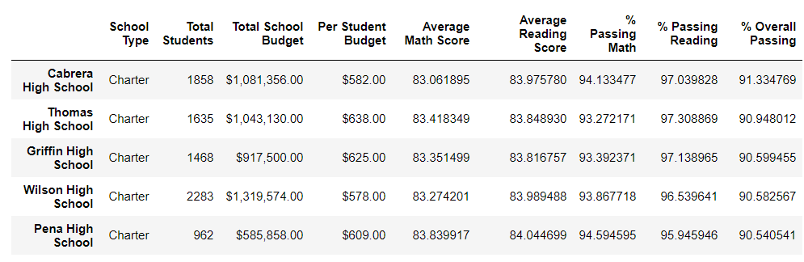
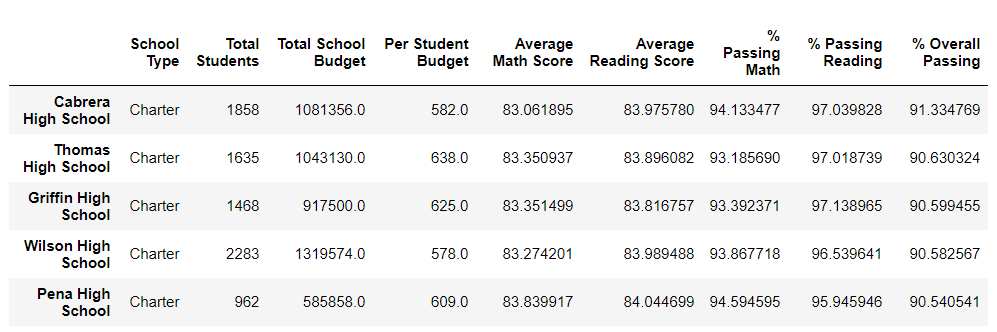

# School_District_Analysis

## Overview of the school district analysis
###### The School District Analysis aims to dtermine whether there has been academic dishonesty with respect to reported scores for 9th graders at Thomas High School. The analysis was carried out by removing the scores for thses 9th graders and observing the impact on the averages for the school.

## Results
###### here are the district summary comparison:

    *The district summary remains largely unchange with the removal of Thomas High School 9th graders' scores
    *The overal passing percentage  for Thomas High School reduced slightly from 90.94 to 90.63 after the 9th graders' scores were romoved.
    * Replacing the 9th graders scores for Thomas High School did not affect their performance relative to other schools as they remained in the 2nd spot among the top 5 schools.
    *After romoving the 9th graders from the Thomas High School records, the school remained in the medium size category with size of 1106
    
## Summary
From the analysis, it does not appear that there has been academic dishonesty from Thomas High School as the results are largely unchanged after thr removal of 9th grade records.

